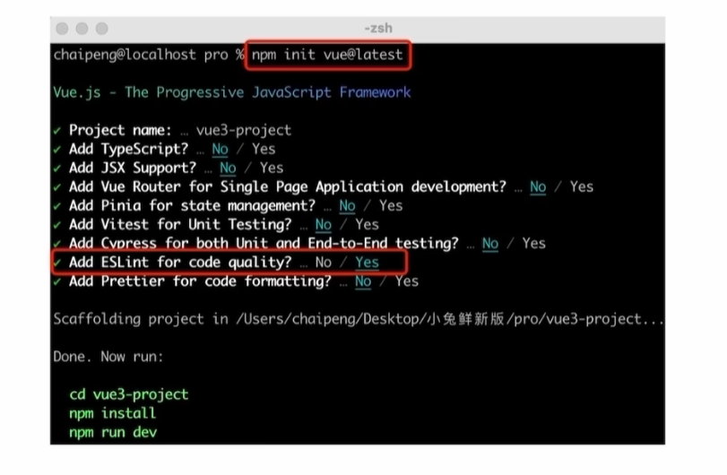

# 小兔鲜电商项目笔记


## 项目技术栈

Vue3全家桶

- Vite：前端构建工具
- create-vue：新一代Vue脚手架
- Pinia：状态管理工具（代替vuex）
- ElementPlus：前端UI框架
- Vue3+Setup：前端技术框架（Setup语法糖）
- Vue-Router：路由管理工具
- VueUse：Vue的组合工具集（涵盖了很多常用的工具类方法）


## 项目规模&亮点


亮点：


## 认识create-vue

create-vue是Vue<span style="color:red;">官方新的脚手架工具</span>，底层切换到了<span style="color:red;">vite（下一代前端工具链）</span>，为开发提供极速响应


### 使用create-vue创建项目

==1.前提环境条件==：<span style="color:red;">已经安装16.0或更高版本的 Node.js</span>


2.创建一个Vue应用：`npm init vue@latest`，这一指令将会安装并执行create-vue



3.熟悉项目目录和关键文件

**package.json** 中存放了项目的相关命令和核心依赖，<span style="color:red;">核心依赖项变成了Vue3.x 和 vite</span>

**vite.config.js** 替代了vue.config.js，作为项目配置文件，<span style="color:red;">是基于vite的配置</span>

**src/main.js** 项目的入口文件，<span style="color:red;">采用了createApp函数创建应用实例</span>

**app.vue** 根组件，<span style="color:red;">SFC单文件组件 script-template-style</span>

- 变化一：脚本script和模板template顺序调整
- 变化二：模板template不再要求唯一根元素
- 变化三：脚本script添加setup标识，支持组合式API

```vue
<!--setup：一个开关，表示允许在script标签中直接书写组合式API-->
<script setup>
import HelloWorld from './components/HelloWorld.vue'
import TheWelcome from './components/TheWelcome.vue'
</script>

<template>
  <!--不再要求唯一根元素-->
  <header>
    

    <div class="wrapper">
      <HelloWorld msg="You did it!" />
    </div>
  </header>

  <main>
    <TheWelcome />
  </main>
</template>

<style scoped>
header {
  line-height: 1.5;
}

.logo {
  display: block;
  margin: 0 auto 2rem;
}

@media (min-width: 1024px) {
  header {
    display: flex;
    place-items: center;
    padding-right: calc(var(--section-gap) / 2);
  }

  .logo {
    margin: 0 2rem 0 0;
  }

  header .wrapper {
    display: flex;
    place-items: flex-start;
    flex-wrap: wrap;
  }
}
</style>
```


**index.html**：单页入口，<span style="color:red;">提供id为app的挂载点</span>


## 组合式API — setup选项

### 写法

```vue
<script>
    export default {
        setup() {
            //...
        },
        beforeCreate() {
            //...
        }
    }
</script>
```


### 执行时机


setup在beforeCreate之前执行

```vue
<script>
export default {
    setup() {
        console.log('setup')
    },
    beforeCreate() {
        console.log('beforeCreate')
    }
}
</script>

<template>
    <div>this is div</div>
</template>
```


### 在setup中写代码的特点

在setup中定义的数据，必须通过一个对象return出去，才能在外部使用

```vue
<script>
export default {
    setup() {
        console.log('setup')
        const message = 'this is message'
        const logMsg = () => {
            console.log(message)
        }

        return {
            message,
            logMsg
        }
    },
    beforeCreate() {
        console.log('beforeCreate')
    }
}
</script>

<template>
    <div>{{ message }}</div>
    <br>
    <button @click="logMsg">Click</button>
</template>
```

如此反复定义和return实在太过麻烦，于是Vue3提供了一个<span style="color:red;"><b>语法糖：就是script标签上的setup</b></span>，可以将上述代码简化成如下

```vue
<script setup>
const message = 'this is message'
const logMsg = () => {
    console.log(message)
}
</script>

<template>
    <div>{{ message }}</div>
    <br>
    <button @click="logMsg">Click</button>
</template>
```

==注意：setup中的this不再指向组件实例，而是指向undefined==


## 组合式API — reactive和ref函数

### reactive()

作用：接收<span style="color:red;">对象类型数据的参数</span>并返回一个<span style="color:red;">响应式的对象</span>

核心步骤：

```vue
<script setup>
    // 导入函数
    import { reactive } from 'vue'
    // 执行函数 传入参数 变量接收
    const state = reactive(对象类型数据)
</script>
```

举例：

```vue
<script setup>
    import { reactive } from 'vue'
    const state = reactive({
        count: 0
    })
    const setCount = () => {
        state.count++
    }
</script>

<template>
	<div>
    	<button @click="setCount">{{ state.count }}</button>
    </div>
</template>
```


### ref()

作用：接收<span style="color:red;">简单类型或者对象类型的数据</span>并返回一个<span style="color:red;">响应式的对象</span>

核心步骤：

```vue
<script setup>
    // 导入函数
    import { ref } from 'vue'
    // 执行函数 传入参数 变量接收
    const count = ref(简单类型或复杂类型数据)
</script>
```

举例：

```vue
<script setup>
	import { ref } from 'vue'
    const state = ref(0)
    const setCount = () => {
        //脚本区域修改ref产生的响应式对象数据，必须通过.value属性
        count.value++
    }
</script>

<template>
	<div>
    	<button @click="setCount">{{ state.count }}</button>
    </div>
</template>
```


## 组合式API — computed函数

计算属性核心思想和Vue2的完全一致，组合式API下的计算属性只是修改了写法

核心步骤：

```vue
<script setup>
    // 导入函数
    import { computed } from 'vue'
    // 执行函数 变量接收 在回调参数中return计算值
    const computedState = computed(() => {
        return 基于响应式数据做计算之后的值
    })
</script>
```

举例：

```vue
<script setup>
    import { ref, computed } from 'vue'
    const list = ref([1,2,3,4,5,6,7,8])
    const computedList = computed(() => {
        return list.value.filter(it => it > 2)
    })
    
    //设置定时器，测试计算属性是否响应式的
    setTimeout(() => {
        list.value.push(9,10)
    }, 3000)
</script>

<template>
	<div>
    	原始响应式数组 = {{list}}
    </div>
	<div>
        计算属性数组 = {{computedList}}
    </div>
</template>
```


### 最佳实践

1.计算属性中不应该有”副作用“

- <span style="color:red;">比如异步请求/修改dom</span>

2.避免直接修改计算属性的值

- <span style="color:red;">计算属性应该是只读的</span>


## 组合式API — watch函数

作用：侦听一个或者多个数据的变化，数据变化时执行回调函数

两个额外参数：

- **immediate**：立即执行
- **deep**：深度侦听


### 侦听单个数据

```vue
<script setup>
	// 导入watch
    import { ref, watch } from 'vue'
    const count = ref(0)
    // 调用watch 侦听变化
    watch(count, (newValue, oldValue) => {
        console.log(`count发生了变化，旧值为${oldValue}，新值为${newValue}`)
    })
    const setCount = () => {
        count.value++
    }
</script>
```


### 侦听多个数据

同时侦听多个响应式数据的变化，不管哪个数据变化都需要执行回调

```vue
<script setup>
    import { ref, watch } from 'vue'
    const count = ref(0)
    const name = ref('cp')
    // 调用watch 侦听多个数据源
    watch(
    [count, name],
    ([newCount, newName], [oldCount, oldName]) => {
        console.log('count或者name变化了', [newCount, newName], [oldCount, oldName])
    })
    const setCount = () => { count.value = 1 }
    const setName = () => { name.value = 'zs' }
</script>
```


### immediate参数

在侦听器创建时立即出发回调，响应式数据变化之后继续执行回调

```vue
<script>
    import { ref, watch } from 'vue'
    const count = ref(0)
    // 在watch函数中传入第三个参数
    watch(count, () => {
		console.log('count变化了')
	}, {
        immediate: true
    })
    const setCount = () => { count.value = 1 }
</script>
```


### deep参数

默认机制：通过watch监听的ref对象默认是<span style="color:red;">浅层监听的，直接修改嵌套的对象属性不会触发回调执行，</span>需要开启deep选项

```vue
<script setup>
    import { ref, watch } from 'vue'
    const state = ref({ count: 0 })
    watch(state, () => console.log('数据变化了'), {
        deep: true //开启深度监听
    })
    
    const changeStateByCount = () => {
        //直接修改属性 -> 不会触发回调
        state.value.count++
    }
</script>
```

注意：<span style="color:red;">**deep存在性能损耗，尽量不开启deep**</span>


### 精确侦听

==在不开启deep的前提下，侦听age的变化，只有age变化时才执行回调==

```vue
<script setup>
    import { ref, watch } from 'vue'
    const info = ref({
        name: 'cp',
        age: 18
    })
    
    watch(
    () => state.value.age //把要监听的属性作为第一个参数传入
    () => {
        console.log('age变化了')
    })
</script>
```


## 组合式API — 生命周期函数

### Vue3生命周期API

（对比Vue2选项式）


### 生命周期函数基本使用

1.导入生命周期函数

2.执行生命周期函数 传入回调

```vue
<script setup>
    import { onMounted } from 'vue'
    onMounted(() => {
        // 自定义逻辑
    })
</script>
```

3.生命周期函数是可以执行多次的，多次执行时传入的回调会在<span style="color:red;">时机成熟时依次执行</span>

```vue
<script setup>
    import { onMounted } from 'vue'
    onMounted(() => {
        console.log('组件挂载完毕，mounted执行了1')
    })
    
    onMounted(() => {
        console.log('组件挂载完毕，mounted执行了2')
    })
</script>
```


## 组合式API — 父子通信

### 父传子

基本思想：

1.父组件中给子组件绑定属性

```vue
<script setup>
// 引入子组件
import SonCom from "@/components/son-com.vue";
</script>

<template>
    <div class="father">
        <h2>父组件App</h2>
        <!-- 1.绑定属性 message -->
        <son-com message="this is app message"/>
    </div>
</template>
```

2.子组件内部通过props选项接收

```vue
<script setup>
//2.通过defineProps接收数据
const props = defineProps({
    message: String
})

console.log(props)
</script>

<template>
    <div class="son">
        <h3>子组件Son</h3>
        <div>父组件传入的数据 - {{ message }}</div>
    </div>
</template>
```


**拓展**：传递响应式数据

```vue
<script setup>
// 引入子组件
import SonCom from "@/components/son-com.vue";

// 父给子传递响应式数据
import {ref} from 'vue'
const count = ref(100)
// 延时引起数据变化
setTimeout(() => {
    count.value = 200
}, 3000)
</script>

<template>
    <div class="father">
        <h2>父组件App</h2>
        <!-- 1.绑定属性 message -->
        <son-com message="this is app message" :count="count"/>
    </div>
</template>
```


```vue
<script setup>
//2.通过defineProps接收数据
const props = defineProps({
    message: String,
    count: Number
})

console.log(props)
</script>

<template>
    <div class="son">
        <h3>子组件Son</h3>
        <div>父组件传入的数据 - {{ message }} - {{count}}</div>
    </div>
</template>
```


#### 关于defineProps函数

编译器宏函数之一，这一类函数的主要作用就是==在编译时把函数中传入的代码转变为Vue2中我们所熟悉的形式==，例如这里


### 子传父

基本思想：

1.父组件中给子组件标签通过@绑定事件

```vue
<script setup>
// 引入子组件
import SonCom from "@/components/son-com.vue";

const getMessage = msg => {
    console.log(msg)
}
</script>

<template>
    <!--1.绑定自定义事件-->
    <son-com @getMsg="getMessage"/>
</template>
```

2.子组件内部通过$emit方法触发事件

```vue
<script setup>
// 2.通过defineEmits编译器宏生成emit方法
const emit = defineEmits(['getMsg'])

const setMessage = () => {
    emit('getMsg', 'this is son msg')
}
</script>

<template>
    <button @click="setMessage">sendMessage</button>
</template>
```

<span style="color:green;"><b>原理简述：在父组件中给子组件绑定一个函数，该函数专门用来接收和处理从子组件中传过来的数据；</b></span>

<span style="color:blue;"><b>在子组件中通过定义的emit函数来调用父组件中绑定的数据处理函数</b></span>


## 组合式API — 模板引用

概念：通过ref标识，获取真实的dom对象或者组件实例对象

使用：

1.通过ref函数生成一个ref对象

2.通过ref标识绑定ref对象到标签


实例：通过模板引用获取自定义组件实例对象

```vue
<script setup>
import {onMounted, ref} from "vue";
import SonCom from "@/components/son-com.vue";

// 1.调用ref函数得到ref对象
const sonRef = ref(null)

// 组件挂载完毕才能获取到dom元素
onMounted(() => {
    console.log(sonRef.value)
})
</script>

<template>
    <!--2.通过ref标识绑定ref对象-->
    <son-com ref="sonRef"/>
</template>
```

==注意：==其中**SonCom**组件实例的定义如下：

```vue
<script setup>

import {ref} from "vue";

const name = ref('test name')
const setName = () => {
    name.value = 'test new name'
}
</script>

<template>
    <div>我是son组件</div>
</template>
```

但是，我们通过模板引用获取组件实例的打印结果却如下：


<span style="color:red;">那么问题来了：为什么我们通过模板引用获取的组件实例中没有看到我们在组件中定义的东西？</span>

那是因为**默认情况下，在&lt;script setup&gt;语法糖下，组件内部的属性和方法是不开放给父组件访问的**

我们可以通过编译宏**defineExpose**指定要暴露的属性和方法

```vue
<script setup>

import {ref} from "vue";

const name = ref('test name')
const setName = () => {
    name.value = 'test new name'
}

// 通过defineExpose编译器宏指定哪些东西要暴露给外部
defineExpose({
    name,
    setName
})
</script>

<template>
    <div>我是son组件</div>
</template>
```


## 组合式API — provide和inject

作用：顶层组件向任意的底层组件<span style="color:red;">传递数据和方法</span>，实现跨层组件通信

### 跨层传递普通数据

1.顶层组件通过<span style="color:red;">provide函数</span>提供数据

```vue
<script setup>
import RoomMsgItem from "@/components/room-msg-item.vue";
import {provide} from "vue";
// 组件嵌套关系：
// RoomPage -> RoomMsgItem -> RoomMsgComment

// 1.顶层组件提供数据
provide('data-key', 'this is room data')
</script>

<template>
    <div>
        顶层组件
        <RoomMsgItem style="margin: 20px;"/>
    </div>
</template>
```

2.底层组件通过<span style="color:red;">inject函数</span>获取数据

```vue
<script setup>
import {inject} from "vue";

// 2.接收数据
const roomData = inject('data-key')
</script>

<template>
  <div class="comment">
      底层组件：
      <div>来自顶层组件中的数据为：{{roomData}}</div>
  </div>
</template>
```


### 跨层传递响应式数据

在调用**provide**函数时，第二个参数设置为ref对象：

```vue
<script setup>
import RoomMsgItem from "@/components/room-msg-item.vue";
import {provide, ref} from "vue";
// 组件嵌套关系：
// RoomPage -> RoomMsgItem -> RoomMsgComment

// 1.顶层组件提供数据
provide('data-key', 'this is room data')

const count = ref(0)
// 传递响应式数据
provide('count-key', count)

setTimeout(() => {
    count.value++
}, 1000)

</script>

<template>
    <div>
        顶层组件
        <RoomMsgItem style="margin: 20px;"/>
    </div>
</template>
```

获取数据的方式不变：

```vue
<script setup>
import {inject} from "vue";

// 2.接收数据
const roomData = inject('data-key')

// 接收响应式数据
const countData = inject('count-key')

</script>

<template>
    <div class="comment">
        底层组件：
        <div>来自顶层组件中的数据为：{{ roomData }}</div>
        <div>来自顶层组件的响应式数据为：{{ countData }}</div>
    </div>
</template>
```


### 跨层传递方法

在调用**provide**函数时，第二个参数设置为方法对象：

```vue
<script setup>
import RoomMsgItem from "@/components/room-msg-item.vue";
import {provide, ref} from "vue";
// 组件嵌套关系：
// RoomPage -> RoomMsgItem -> RoomMsgComment

// 1.顶层组件提供数据
provide('data-key', 'this is room data')

const count = ref(0)
// 传递响应式数据
provide('count-key', count)

setTimeout(() => {
    count.value++
}, 1000)

const setCount = () => {count.value++}
// 跨层传递方法(原则：谁的数据谁负责修改，所以要传入方法)
provide('setCount-key', setCount)

</script>

<template>
    <div>
        顶层组件
        <RoomMsgItem style="margin: 20px;"/>
    </div>
</template>
```

获取方法：

```vue
<script setup>
import {inject} from "vue";

// 2.接收数据
const roomData = inject('data-key')

// 接收响应式数据
const countData = inject('count-key')

// 在底层组件也可以修改顶层组件传入的响应式数据的值
// setTimeout(() => {countData.value++}, 2000)

// 接收方法
const setCount = inject('setCount-key')

</script>

<template>
    <div class="comment">
        底层组件：
        <div>来自顶层组件中的数据为：{{ roomData }}</div>
        <div>来自顶层组件的响应式数据为：{{ countData }}</div>
        <div>
            <button @click="setCount">修改顶层组件的数据count</button>
        </div>
    </div>
</template>
```


## 综合案例

实现页面中的功能：

- 列表渲染
- 删除
- 编辑


详见项目：`vue3-case`


## Pinia

Pinia是Vue的专属的最新<span style="color:red;">状态管理库</span>，是Vuex的替代品

优势：


### 在Vue项目中添加Pinia

安装Pinia：`npm install pinia`

在项目中引入Pinia

```js
import { createApp } from 'vue'
import App from './App.vue'

// 1.导入createPinia
import {createPinia} from "pinia"

// 2.执行方法得到实例
const pinia = createPinia()

// 3.把Pinia实例加入到app应用中
createApp(App).use(pinia).mount('#app')

```


### 基础使用

定义Store

```js
import {defineStore} from "pinia"
import {ref} from "vue";

// 写法一
// export const useCounterStore = defineStore('counter', {
//     state: () => {
//         return {
//             count: 0
//         }
//     },
//     actions: {
//         increment() {
//             this.count++
//         }
//     }
// })

// 写法二
export const useCounterStore = defineStore('counter', () => {
    // 数据（state）
    const count = ref(0)
    // 修改数据的方法（action）
    const increment = () => {
        count.value++
    }

    // 以对象形式返回
    return {count, increment}
})
```

在组件中使用

```vue
<script setup>
// 1.导入 use 打头的方法
import {useCounterStore} from "@/stores/counter";

// 2.执行方法得到store实例对象
const counterStore = useCounterStore()
</script>

<template>
  <button @click="counterStore.increment">{{counterStore.count}}</button>
</template>

<style scoped>
</style>
```


### getters

Pinia中的getters直接使用**computed**函数进行模拟

```js
import {defineStore} from "pinia"
import {computed, ref} from "vue";

// 写法二
export const useCounterStore = defineStore('counter', () => {
    // 数据（state）
    const count = ref(0)
    // 修改数据的方法（action 支持同步+异步）
    const increment = () => {
        count.value++
    }
    // getter 定义
    const doubleCount = computed(() => count.value * 2)

    // 以对象形式返回
    return {count, increment, doubleCount}
})
```

在组件中使用

```vue
<script setup>
// 1.导入 use 打头的方法
import {useCounterStore} from "@/stores/counter";

// 2.执行方法得到store实例对象
const counterStore = useCounterStore()
</script>

<template>
  <button @click="counterStore.increment">{{counterStore.count}}</button>
  &nbsp;{{counterStore.doubleCount}}
</template>

<style scoped>
</style>
```


### 异步action

action如何实现异步：action中实现异步和组件中定义数据、方法的风格完全一致

```js
const API_URL = 'http://geek.itheima.net/v1_0/channels'
// 准备数据（state）
const list = ref([])
// 异步action
const loadList = async () => {
    const res = await axios.get(API_URL)
    list.value = res.data.data.channels
}
```


### storeToRefs

使用storeToRefs函数可以辅助保持数据（state + getter）的响应式结构

```js
// 数据直接解构赋值（响应式丢失）
const {count, doubleCount} = counterStore

// 方法包裹（保持响应式更新）
const {count, doubleCount} = storeToRefs(counterStore)

// 方法直接从原来的store中解构赋值
const {increment} = counterStore
```


## 项目开发

### 项目初始化


规范项目结构，src目录调整


### 配置别名路径联想提示

在编写代码的过程中，一旦输入 `@/`，IDE会立刻联想出src下的所有子目录和文件，同一文件路径访问不容易出错

步骤：

1.在项目的根目录下，新增jsconfig.json文件

2.添加json格式的配置项

```json
{
  "compilerOptions": {
    "baseUrl": "./",
    "paths": {
      "@/*": [
        "src/*"
      ]
    }
  }
}
```

==注意==：

上述配置项只做联想提示，实际的路径转换 @ -> src 在vite.config.js中

```js
import { fileURLToPath, URL } from 'node:url'

import { defineConfig } from 'vite'
import vue from '@vitejs/plugin-vue'

// https://vitejs.dev/config/
export default defineConfig({
  plugins: [vue()],
  resolve: {
    // 实际的路径转换 @ -> src
    alias: {
      '@': fileURLToPath(new URL('./src', import.meta.url))
    }
  }
})
```


### elementPlus按需导入


引入elementPlus并配置其按需导入

[官方文档](https://element-plus.gitee.io/zh-CN/guide/quickstart.html#%E6%8C%89%E9%9C%80%E5%AF%BC%E5%85%A5)

依次执行以下命令：

elementPlus安装：`npm install element-plus --save`

按需导入所用插件：`npm install -D unplugin-vue-components unplugin-auto-import`

在vite.config.js中添加配置：

```js
plugins: [
    vue(),
    // 配置elementPlus按需导入
    AutoImport({
        resolvers: [ElementPlusResolver()],
    }),
    Components({
        resolvers: [ElementPlusResolver()],
    })
]
```


### elementPlus主题定制

为了让整个项目有自己的风格，我们需要定制elementPlus主题

定制方式如下：


1.运行命令：`npm i sass -D`

2.创建 **styles/element/index.scss**

```scss
/* 只需要重写你需要的即可 */
@forward 'element-plus/theme-chalk/src/common/var.scss' with (
  $colors: (
    'primary': (
      // 主色
      'base': #27ba9b,
    ),
    'success': (
      // 成功色
      'base': #1dc779,
    ),
    'warning': (
      // 警告色
      'base': #ffb302,
    ),
    'danger': (
      // 危险色
      'base': #e26237,
    ),
    'error': (
      // 错误色
      'base': #cf4444,
    ),
  )
);
```

3.在**vite.config.js**中配置：

①配置elementPlus采用

②自动导入定制化样式文件进行样式覆盖

```js
import {fileURLToPath, URL} from 'node:url'

import {defineConfig} from 'vite'
import vue from '@vitejs/plugin-vue'

// 配置elementPlus按需导入
import AutoImport from 'unplugin-auto-import/vite'
import Components from 'unplugin-vue-components/vite'
import {ElementPlusResolver} from 'unplugin-vue-components/resolvers'

// https://vitejs.dev/config/
export default defineConfig({
    plugins: [
        vue(),
        // 配置elementPlus按需导入
        AutoImport({
            resolvers: [ElementPlusResolver()],
        }),
        Components({
            resolvers: [
                // 1.配置elementPlus采用sass样式配色系统
                ElementPlusResolver({ importStyle: 'sass'})
            ],
        })
    ],
    resolve: {
        // 实际的路径转换 @ -> src
        alias: {
            '@': fileURLToPath(new URL('./src', import.meta.url))
        }
    },
    css: {
        preprocessorOptions: {
            scss: {
                // 2.自动导入定制化样式文件进行样式覆盖
                additionalData: `@use "@/styles/element/index.scss" as *;`
            }
        }
    }
})
```

4.运行项目，使用el-button按钮组件进行验证


